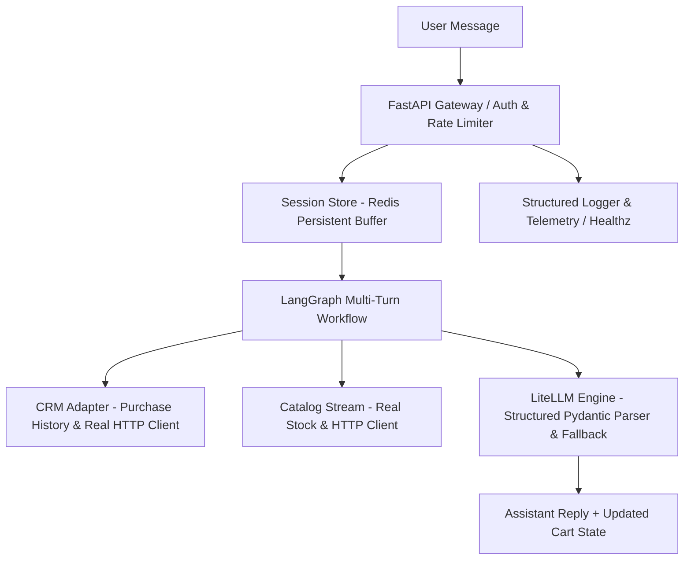

# Cartly: Multi-Turn Conversational Chat Engine Execution Plan

This execution plan focuses on building **Cartly** as a multi-turn conversational chat engine engineered for **real-world production deployment**. The user interacts back and forth over multiple messages in a long-window session, building and refining a shopping basket over time.

Each phase is broken down into incremental steps with immediate human verification methods (unit tests, curl, docker-compose, and interactive terminal CLI runner).

---

## Architecture Flow



---

## Phase 1: Environment & Multi-Turn State Schemas

### Step 1.1: Project Dependencies & Environment Configuration
* **Goal:** Set up dependencies for FastAPI, LiteLLM, LangGraph, Pydantic v2, `pydantic-settings`, Redis client (`redis`), `httpx`, `structlog`, `slowapi`, `uvicorn`, and `pytest`. Configure `.env.example` and environment settings.
* **Files to Edit:** [`requirements.txt`](requirements.txt:1), [`src/cartly/config.py`](src/cartly/config.py)
* **Human Verification:**
  ```bash
  pip install -r requirements.txt
  ```
  *Check:* Installation completes cleanly without dependency errors.

### Step 1.2: Conversational & Cart State Schemas
* **Goal:** Define Pydantic models for multi-turn sessions and structured outputs: `ChatMessage`, `ChatSession`, `SKU`, `CartItem`, `ShoppingBasket`, `PendingClarification`, `IntentActionEnum` (ADD, REMOVE, MODIFY_QUANTITY, SUBSTITUTE, CLARIFY), `ParsedIntent`, and `ChatRequest`/`ChatResponse`.
* **Files to Edit:** [`src/cartly/models/schemas.py`](src/cartly/models/schemas.py), [`src/cartly/models/__init__.py`](src/cartly/models/__init__.py:1)
* **Tests to Add:** [`tests/test_models.py`](tests/test_models.py:1)
* **Human Verification:**
  ```bash
  pytest tests/test_models.py
  ```
  *Check:* Validates model initialization, multi-turn history structure, intent action schemas, and state serialization.

---

## Phase 2: Session Memory & Middleware Adapters

### Step 2.1: Multi-Turn Session Memory Store (Sliding-Window Buffer & Redis Interface)
* **Goal:** Implement an abstract `BaseSessionStore` interface with concrete `InMemorySessionStore` and production-grade `RedisSessionStore` adapters with connection pooling and reconnection resilience. Retain dialogue history using a sliding-window message buffer.
* **Files to Edit:** [`src/cartly/services/session.py`](src/cartly/services/session.py)
* **Tests to Add:** [`tests/test_session.py`](tests/test_session.py)
* **Human Verification:**
  ```bash
  pytest tests/test_session.py
  ```
  *Check:* Verify adding messages across multiple turns respects sliding window, preserves basket state, and operates with both in-memory and Redis backends.

### Step 2.2: CRM Adapter (User Context & Preferences)
* **Goal:** Create `UserContextProvider`, `MockCRMAdapter`, and HTTP-backed `RestCRMAdapter` supplying past order history and default brand preferences with fallback options.
* **Files to Edit:** [`src/cartly/services/crm.py`](src/cartly/services/crm.py)
* **Tests to Add:** [`tests/test_crm.py`](tests/test_crm.py)
* **Human Verification:**
  ```bash
  pytest tests/test_crm.py
  ```
  *Check:* User context retrieval correctly maps past favorites and default choices.

### Step 2.3: Catalog Adapter (Stock & Recipe Mapping)
* **Goal:** Create `InventoryProvider`, `MockCatalogAdapter`, and real HTTP-backed `RestCatalogAdapter` with timeout, retry logic, and real-time stock/pricing lookup.
* **Files to Edit:** [`src/cartly/services/catalog.py`](src/cartly/services/catalog.py)
* **Tests to Add:** [`tests/test_catalog.py`](tests/test_catalog.py)
* **Human Verification:**
  ```bash
  pytest tests/test_catalog.py
  ```
  *Check:* Searches and recipe triggers accurately resolve to concrete SKUs.

---

## Phase 3: LangGraph Multi-Turn Dialogue Engine & Resilience

### Step 3.1: LiteLLM Dialogue & Structured Intent Node
* **Goal:** Build model-agnostic dialogue handler with LiteLLM structured output parsers (`PydanticOutputParser`) and automatic fallback handling for extraction failures. Support actions: Item Addition, Item Removal, Quantity Modification, Out-of-Stock Substitutions, and Clarifications.
* **Files to Edit:** [`src/cartly/services/intent.py`](src/cartly/services/intent.py)
* **Tests to Add:** [`tests/test_intent.py`](tests/test_intent.py)
* **Human Verification:**
  ```bash
  pytest tests/test_intent.py
  ```
  *Check:* Verifies structured intent parsing for all actions with provider fallback logic.

### Step 3.2: LangGraph Conversational Workflow
* **Goal:** Construct multi-turn state graph coordinating History -> Structured Intent Resolution -> CRM Defaults -> Inventory Check & Substitution Engine -> Clarification / Basket Update.
* **Files to Edit:** [`src/cartly/services/workflow.py`](src/cartly/services/workflow.py)
* **Tests to Add:** [`tests/test_workflow.py`](tests/test_workflow.py)
* **Human Verification:**
  ```bash
  pytest tests/test_workflow.py
  ```
  *Check:* Verify multi-turn dialogue yields expected basket state changes.

---

## Phase 4: Checkout Handshake, Interactive CLI & Web API

### Step 4.1: Supermarket Checkout Handshake
* **Goal:** Implement checkout handshake converting finalized active cart into supermarket checkout payload.
* **Files to Edit:** [`src/cartly/services/checkout.py`](src/cartly/services/checkout.py)
* **Tests to Add:** [`tests/test_checkout.py`](tests/test_checkout.py)
* **Human Verification:**
  ```bash
  pytest tests/test_checkout.py
  ```
  *Check:* Final cart converts cleanly into target checkout payload format.

### Step 4.2: Interactive Terminal Chat CLI
* **Goal:** Build an interactive terminal runner script (`src/cartly/cli.py`) for live back-and-forth multi-turn testing.
* **Files to Edit:** [`src/cartly/cli.py`](src/cartly/cli.py)
* **Human Verification:**
  ```bash
  python -m cartly.cli
  ```
  *Check:* Interactively test dialogue in terminal with real-time cart state feedback.

### Step 4.3: FastAPI Web Endpoints & Standardized HTTP Exception Handlers
* **Goal:** Expose `/api/v1/chat/message`, `/api/v1/chat/session/{session_id}`, and `/api/v1/checkout/handshake`. Incorporate standardized HTTP exception handlers (422 validation failures, 404 session/SKU not found, 503 downstream timeouts).
* **Files to Edit:** [`src/cartly/main.py`](src/cartly/main.py:1)
* **Tests to Add:** [`tests/test_main.py`](tests/test_main.py)
* **Human Verification:**
  ```bash
  pytest tests/test_main.py
  ```
  *Check:* Endpoints process chat requests and return validated HTTP responses.

---

## Phase 5: Production Readiness, Security & Deployment Infrastructure

### Step 5.1: Observability, Structured Logging & Health Probes
* **Goal:** Add structured JSON logging via `structlog`, request tracking middleware, and `/healthz` (liveness) and `/readyz` (readiness checking Redis and external API status) endpoints.
* **Files to Edit:** [`src/cartly/main.py`](src/cartly/main.py:1), [`src/cartly/utils/logging.py`](src/cartly/utils/logging.py)
* **Tests to Add:** [`tests/test_health.py`](tests/test_health.py)
* **Human Verification:**
  ```bash
  pytest tests/test_health.py
  ```
  *Check:* Liveness and readiness endpoints return valid 200 health status reports.

### Step 5.2: Authentication, Security & Rate Limiting
* **Goal:** Implement API key / JWT session middleware, CORS configuration, and endpoint rate-limiting using `slowapi` to protect against abusive requests.
* **Files to Edit:** [`src/cartly/middleware/security.py`](src/cartly/middleware/security.py), [`src/cartly/main.py`](src/cartly/main.py:1)
* **Tests to Add:** [`tests/test_security.py`](tests/test_security.py)
* **Human Verification:**
  ```bash
  pytest tests/test_security.py
  ```
  *Check:* Unauthenticated and rate-exceeded requests return HTTP 401/429 correctly.

### Step 5.3: Containerization & Docker Orchestration
* **Goal:** Create production multi-stage `Dockerfile` and `docker-compose.yml` bundling FastAPI app with Uvicorn/Gunicorn workers and a Redis service.
* **Files to Create:** [`Dockerfile`](Dockerfile), [`docker-compose.yml`](docker-compose.yml), [`.env.example`](.env.example)
* **Human Verification:**
  ```bash
  docker-compose up --build
  ```
  *Check:* Full stack boots up cleanly, passes health check, and responds to `/api/v1/chat/message`.
